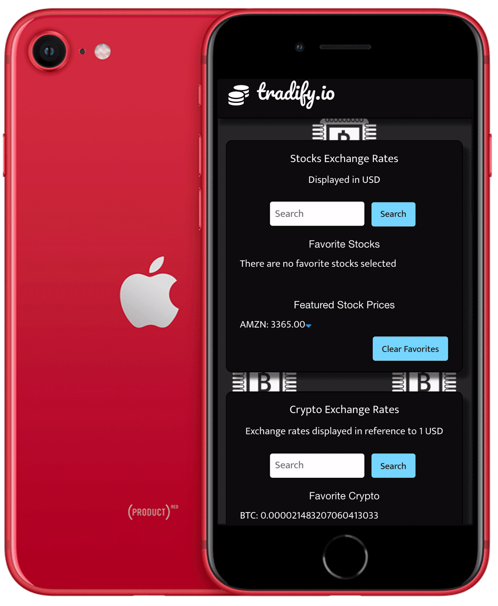
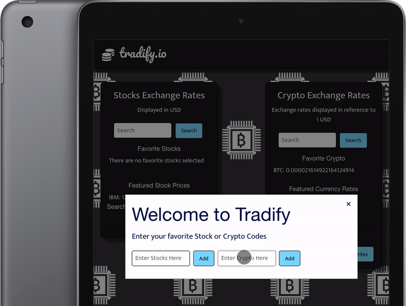

# Finance Application

## 

## Overview

Tradify app is cutting edge investment tool for today's investors.
This app will run in the browser and feature dynamically updated HTML and CSS powered by javascript. This app is also using Foundation CDN for styling HTML (https://dhbhdrzi4tiry.cloudfront.net/cdn/sites/foundation.min.css).
This app is using the API from [Stock API](https://www.alphavantage.co/documentation/) to retrieve current stock and we also allow users to search current cryptocurrency prices using [Coinbase API](https://developers.coinbase.com/).

## User Story

AS A person with a computer and an internet connection  
I WANT to see information relating to finances that I choose  
SO THAT I am able to make better financial decisions and have to put in less work to find the information

### Project features:

- Search bar to search stock and cryptocurrency price
- Favorite stocks and currencies can be saved as favorites for quick reference.
- Responsive mobile-first UI
- Randomly render one feature stock and 5 crypto currency prices

### Script features:

- API calls
- Event listener (onclick)
- functions, for loop and if condition
- Local storage

## Project Demo

When I open the Tradify app modal is displayed.

Then the user can add their favorite stock or cryto currency for quick reference.
