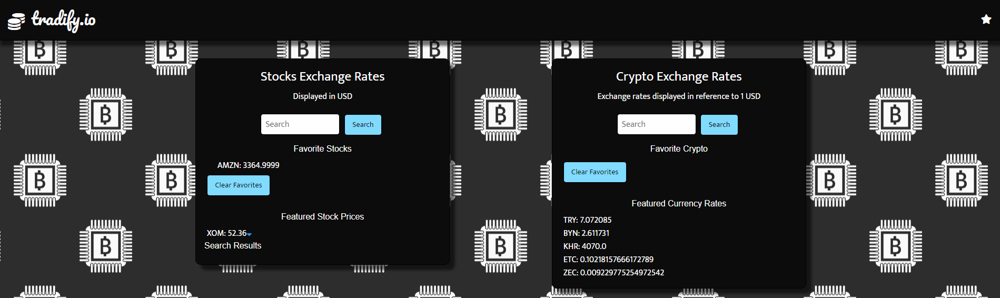
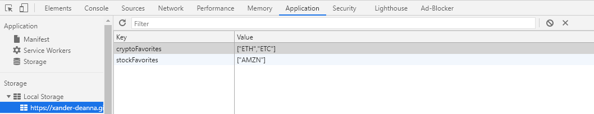
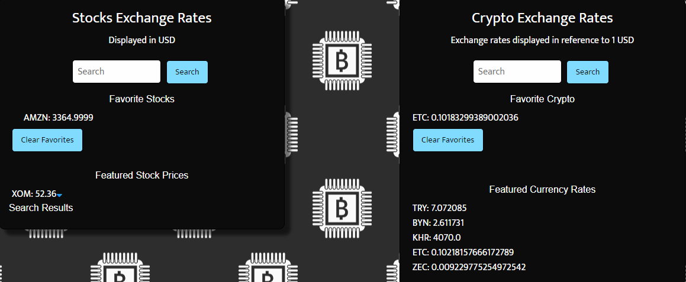
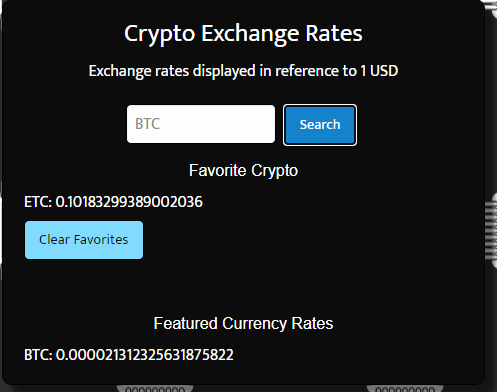

### 

# **Tradify - a financial investment tool**

_Tradify is a cutting edge investment tool for today's investors._

_Motivated by the recent financial revolution happening in US markets, we wanted to develop a tool that empowers investors of all types, levels, and interest. With Tradify, savvy investors who want to peer into the world of stocks, cryptocurrency, and foreign exchange markets, can access our platform to get up to the minute pricing data and insight in three financial markets in one tool, instead of having to use a separate tool for each.
This app will run in the browser and feature dynamically updated HTML and CSS powered by jquery, and uses Foundation CDN for styling. Users can retrieve current stocks using [Stock API](https://www.alphavantage.co/documentation/), and cryptocurrency prices using [Coinbase API](https://developers.coinbase.com/)._

## **Project features:**

- _Search bar to search stock and cryptocurrency prices_
- _Stocks and currencies can be saved as favorites for quick reference._
- _Responsive mobile-first UI_
- _Randomly render one feature stock and 5 crypto currency prices_

## **Script features:**

- _API call (Fetch and AJAX)_
- _Event listener (onclick)_
- _Object, function, array, for loop and if condition_
- _Dynamically create new DOM elements_
- _Local storage_

## **Project Demo**

_When I open the Tradify app it will randomly render one feature stock price and 5 crypto currency prices_
_This app will also display favorite stocks and currencies for quick reference._

### 

_When the favorite button is clicked from the navigation bar the favorites modal will be displayed._
_Then the user can add their favorite stock or crytocurrency for quick reference._

### 

_Favorite stocks and currencies are saved in local storage._

### 

_The user also has the option to clear their favorite stocks and cryptocurrencies

### 

_We also allow users to search current stock price and cryptocurrency_

### 

## **Link**

https://xander-deanna.github.io/project-1-group-7/index.html

## **Repository**

https://github.com/xander-deanna/project-1-group-7.git

## **Technologies**

_Visual Studio code, HTML5, Foundation, CSS, Javascript, jQuery, AJAX and server side API_

## **Team Members**

- _Deanna Alexander_
- _Ivan Zabrodin_
- _Mark Lloyd_
- _Kanna Vairavan_

