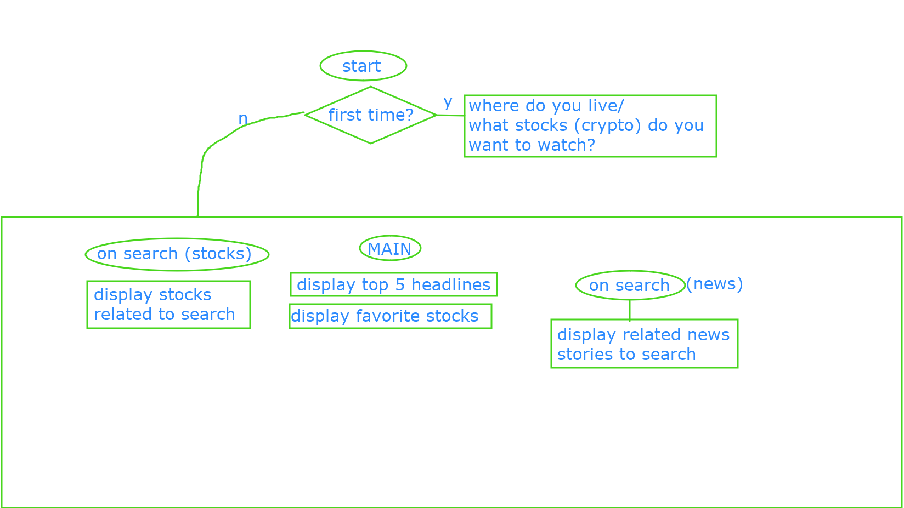

# Local News and Finance Application

## Overview
We propose to develop a news and finance application that will allow users to search news headlines and stories based on user selected criteria. We will use [News Api](https://newsapi.org/).
We will also allow users to search current stock and cryptocurrency prices using [Coinbase api](https://developers.coinbase.com/).

## User Story
AS A person with a computer and an internet connection  
I WANT to see news information relating to the local area where I live  
SO THAT I am more informed about events that may directly affect me  
I WANT to see information relating to finances that I choose  
SO THAT I am able to make better financial decisions and have to put in less work to find the information  

## Wireframe

## User Flow

## Tasks

